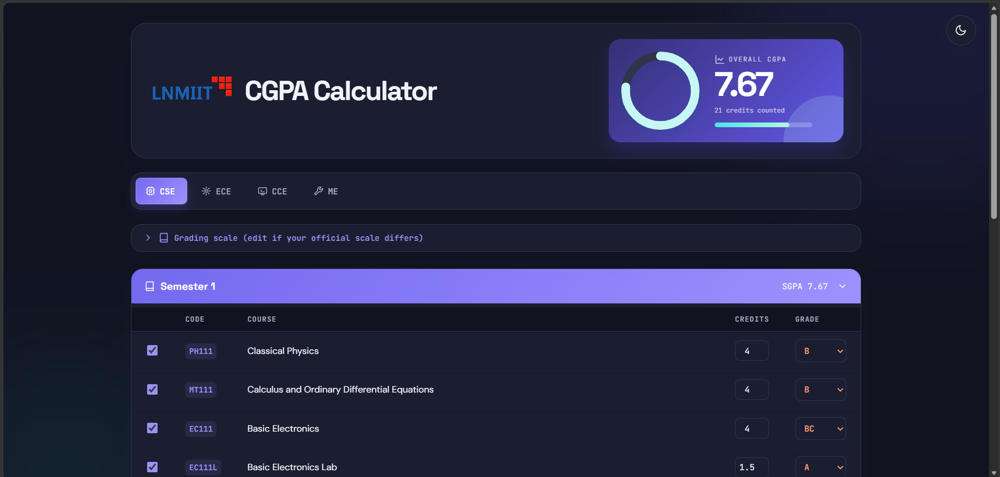
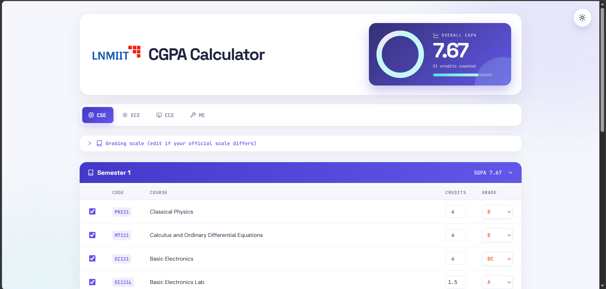

<div align="center">


# 🎓 LNMIIT CGPA Calculator

### A modern, responsive browser-based CGPA & SGPA Calculator for LNMIIT Undergraduate Students


</div>

---

## 📖 About

A responsive, browser-based CGPA calculator for **LNMIIT undergraduate programmes**.

Select your branch, enter grades semester by semester, and the calculator automatically computes:

- 📈 Semester SGPA
- 🎯 Overall CGPA
- 🎓 Credits Completed
- 📊 Academic Progress

No installation. No backend. No database.

Everything works directly inside your browser.

---

# ✨ Features

## 🎓 Supported Branches

- 💻 Computer Science & Engineering (CSE)
- 📡 Electronics & Communication Engineering (ECE)
- 🌐 Communication & Computer Engineering (CCE)
- ⚙️ Mechanical Engineering (ME)

---

## 📚 Academic Features

- 📊 Automatic SGPA Calculation
- 🎯 Automatic Overall CGPA Calculation
- 📖 Semester-wise Course Listing
- 📝 Editable Course Names
- 🎓 Editable Credits
- 🔢 Editable Grading Scale
- 🚫 Automatically Excludes Non-Graded Mandatory Courses
- 🎓 Semester 8 Study Path Selection

---

## 🎨 User Experience

- 🌙 Light / Dark Theme
- 📱 Fully Responsive Design
- 💾 Auto Save using Browser Local Storage
- ⚡ Instant Calculations
- 🎯 Clean Modern Interface
- 📈 Interactive CGPA Progress Gauge

---

# 🖼️ Preview

<div align="center">

### Desktop View



<br><br>

### Dark Mode



</div>

---

# 🚀 Run Locally

No installation or build step is required.

### Clone Repository

```bash
git clone https://github.com/yourusername/LNMIIT-CGPA-Calculator.git
```

### Open

Simply open

```text
index.html
```

in any modern browser.

---

# 💾 Data & Privacy

✔ No Backend

✔ No Database

✔ No User Accounts

✔ No Data Collection

All grades and preferences are stored locally using **Browser Local Storage**.

Your data never leaves your device.

---

# 📂 Project Structure

```text
📦 LNMIIT-CGPA-Calculator
│
├── index.html
├── README.md
├── display1.png
├── display2.png
└── lnmiit-logo-transparent.png
```

---

# 🛠️ Built With

- 🌐 HTML5
- 🎨 CSS3
- ⚡ Vanilla JavaScript
- 💾 Browser Local Storage API
- 📱 Responsive Web Design

---

# 📌 Highlights

- 🎯 Accurate Credit-Weighted CGPA Calculation
- 📊 Semester-wise SGPA
- 🌙 Dark Mode Support
- 📱 Mobile Friendly UI
- 💾 Automatic Saving
- ⚡ Fast & Lightweight
- 🚫 No Internet Required
- 🧮 Fully Browser-Based

---

# 📄 Notes

Course structures and grading schemes may change over time.

Always verify the curriculum and grading policy with the latest official LNMIIT academic documents before relying on calculated results.

---

<div align="center">

### ⭐ If you found this project useful, consider giving it a Star!

Made with ❤️ for LNMIIT Students

</div>